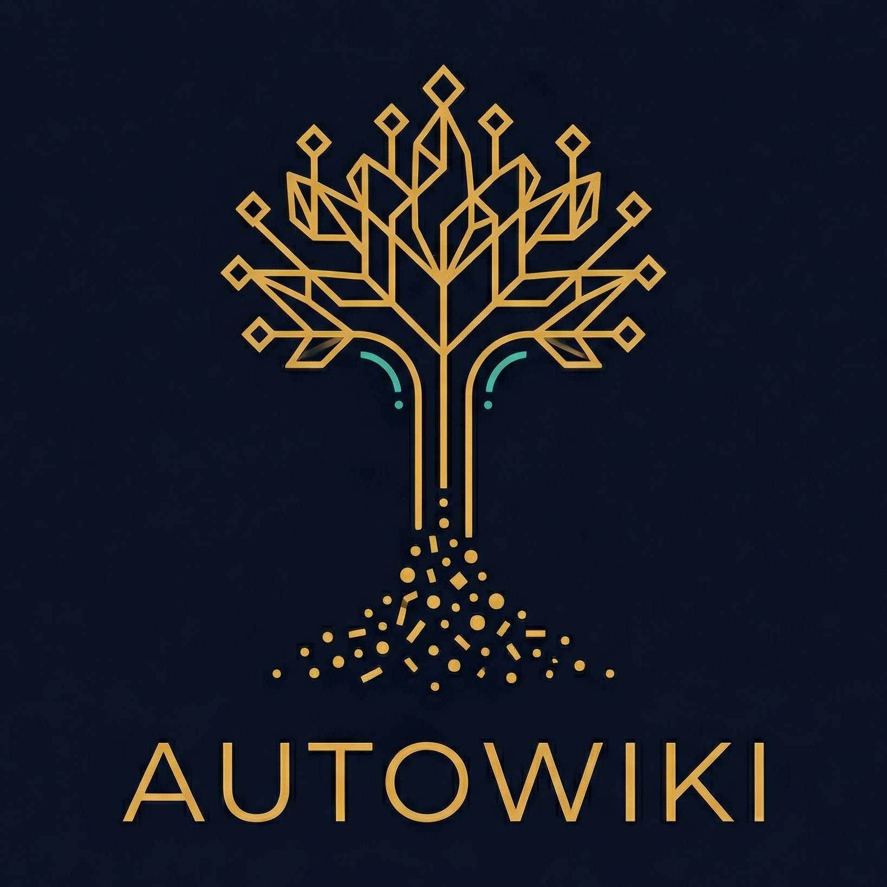
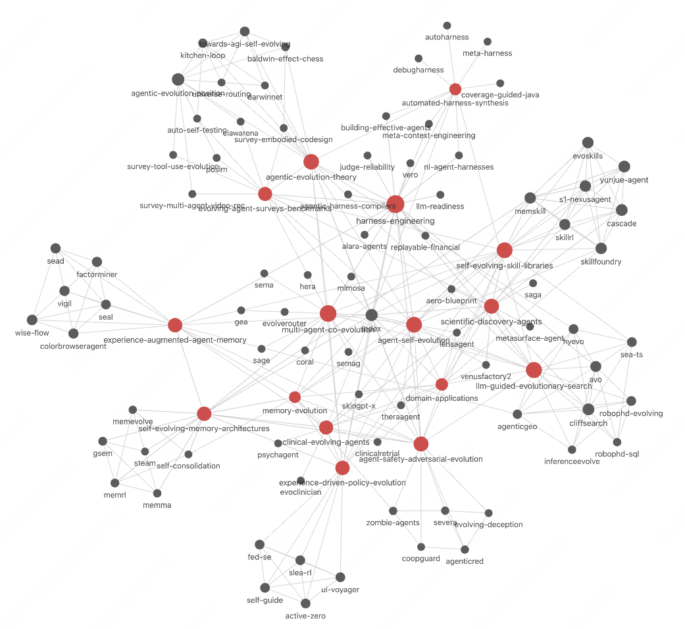

<p align="center">
  
</p>

<h1 align="center">AutoWiki</h1>

<p align="center">
  <strong>LLM 帮你编译知识库，你只需阅读和提问。</strong><br>
  <sub>实现 <a href="https://x.com/karpathy/status/1911101737498091651">Karpathy 的 LLM 知识库</a>构想 — 原始文献进，Obsidian Wiki 出。</sub><br>
  <sub>By <a href="https://github.com/AlphaLab-USTC">AlphaLab-USTC</a></sub>
</p>

<p align="center">
  <a href="https://alphalab-ustc.github.io/AutoWiki-skill/assets/presentation.html">
    
  </a>
</p>

<p align="center">
  <a href="#-快速开始"></a>
  <a href="#-实战展示80-篇论文的-wiki"></a>
  <a href="LICENSE"></a>
  
  
</p>

<p align="center"><a href="README.md">English</a> · 中文</p>

---

## 核心思路

好的综述论文不是罗列参考文献 — 而是**识别里程碑**、梳理思想演化脉络、把领域组织成连贯的结构。AutoWiki 自动做同样的事。

把论文丢进来，LLM 会识别**里程碑节点**（概念性突破），将论文聚类到对应节点，构建反映领域结构的层级文件树，并写出带时间线关联的深度分析。你得到的是 Obsidian 中维护的综述级知识图谱 — 而不是一堆零散笔记。

```
 你丢入 PDF              LLM 编译                          你在 Obsidian 中浏览
─────────────    ──────────────────────────    ──────────────────────────────────
 raw/new/    →    识别里程碑                    kb/topics/  (里程碑节点)
                  聚类论文                      kb/sources/ (深度分析页)
                  追踪时间演化                  kb/journal/ (认知时间线)
                  写入交叉链接的 wiki           index.md    (综述式目录树)
```

---

## 🚀 快速开始

```bash
# 安装
git clone https://github.com/AlphaLab-USTC/AutoWiki-skill.git
pip install PyMuPDF

# 初始化
mkdir -p raw/new raw/compiled kb/{sources,topics,journal} output
touch kb/index.md kb/log.md

# 用 Obsidian 打开项目根目录，然后在 Claude Code 中：
> "帮我 ingest raw/new/ 里的论文"
> "X 和 Y 方向的论文有什么异同？"
> "Lint 一下 wiki"
```

**前置要求：** [Claude Code](https://docs.anthropic.com/en/docs/claude-code) + [Obsidian](https://obsidian.md/) + Python 3.12+

---

## 工作原理

```
raw/new/  ──→  LLM (Claude Code)  ──→  kb/  ──→  Obsidian
  你丢入         阅读、分析、              sources/    你浏览
  PDF            关联、写入                topics/
                                          journal/
```

| 层 | 作用 | 谁负责 |
|----|------|--------|
| `raw/` | 原始文档归档（PDF + 图表） | 你丢文件；agent 整理 |
| `kb/` | 活的 wiki（markdown + wikilinks） | Agent 写入并维护一切 |

三种操作：**Ingest**（PDF → 分析页）、**Query**（提问 → 综合 → 回写）、**Lint**（25+ 项自动检查）。

**图片提取：** 对于 arXiv 论文，直接从 TeX 源码提取图片（`\includegraphics` + `\caption`），获得原始质量的图片和干净的标题文本。对非 arXiv 来源回退到 PDF 区域截取。

---

## 有何不同

| | |
|---|---|
| **🧠 深度分析** | 不是摘要。从作者 Introduction 中提取 CRGP 因子，批判性分析采用 `prior`/`update` 对比结构，内置反模式防止生成空话。 |
| **🔗 时间知识图** | 每篇论文定位在领域时间线上。演化链、跨领域链接、时间张力 — 全自动。 |
| **🏠 自愈 Wiki** | 三级自治：**静默**（修链接）→ **通知**（记录洞察）→ **确认**（重组结构）。25+ 项 lint 检查。 |
| **🎯 智能分类** | 每次分配论文前进行 3 问适配检查。自动伸缩：<5 内联，≥5 拆分，>8 子聚类。 |

---

## 📂 实战展示：80 篇论文的 Wiki

我们用 **Agent Self-Evolution** 方向做了一个真实 wiki — 80 篇论文，13 个里程碑，耗时 2 小时。以下是 LLM 编译的成果（在 Claude Code 中使用 Opus 4.6 编译 80 篇论文消耗约 150 🔪 额度）：

<p align="center">
  
</p>

<sub>每个节点是一个 source 页面。红色节点是里程碑 topic。边是时间关系（extends、complements、contrasts_with）— 全部自动发现。</sub>

### 综述式 Topic 组织

每个 topic 是一个**里程碑节点** — 像综述论文一样，讲述一个研究方向如何演化。

```
agent-self-evolution（80 篇论文，13 个里程碑）
├─ 机制层
│   ├─ self-evolving-skill-libraries          (7 篇)
│   ├─ memory-evolution                       (12 篇，2 个子节点)
│   ├─ experience-driven-policy-evolution     (5)
│   ├─ llm-guided-evolutionary-search         (8)
│   └─ multi-agent-co-evolution               (8)
├─ 应用层
│   └─ domain-applications                    (10 → 科学 + 医学)
└─ 横切层
    ├─ agentic-evolution-theory               (6)
    ├─ agent-safety-adversarial-evolution      (5)
    └─ evolving-agent-surveys-benchmarks       (6)
```

### LLM 编译的产出

| 产出类型 | 示例 | 在线演示 |
|----------|------|----------|
| **Topic** — 组织研究方向的里程碑节点 | agent-self-evolution（80 篇 → 3 层分类） | [**▶ 查看 Topic**](https://alphalab-ustc.github.io/AutoWiki-skill/assets/demo-topic-cn.html) |
| **Source** — 单篇论文的深度分析页 | MemSkill（Zhang et al., 2026）— 可学习的记忆技能 | [**▶ 查看 Source**](https://alphalab-ustc.github.io/AutoWiki-skill/assets/demo-source-cn.html) |

<details>
<summary>Topic 内容预览 — agent-self-evolution.md</summary>

> **里程碑定义：** 基于 LLM 的智能体在部署后自主提升能力的范式 — 将演化时计算视为与训练时计算、推理时计算并列的第三条扩展轴。

**综合分析** — 三个正交层：
- **机制层**（演化什么/怎么演化）：技能库、记忆系统、决策策略、程序/算法、智能体群体
- **应用层**（在哪应用）：科学和医学中验证机制原理的领域实例
- **横切层**（理论/安全/评估）：概念词汇、安全约束、评估基础设施

**统一元原则：** "信息差作为训练信号" — 技能库利用有技能 vs. 无技能的性能差，记忆演化利用有记忆 vs. 无记忆的上下文差，策略演化利用成功 vs. 失败的轨迹差。

</details>

<details>
<summary>Source 内容预览 — memskill.md</summary>

```yaml
type: source
id: memskill
milestone: "[[memory-evolution]]"
tags: [memory-evolution, year/2026, venue/arXiv]
```

> **一句话：** "MemSkill 将智能体记忆提取从固定的手工设计操作重构为可学习、可演化的技能库"

**新颖洞察：**
- *先前认知：* 记忆管理 = 内容问题，用固定逻辑解决（增/删/改）
- *认知更新：* 提取过程本身就是一个变量 — 把"怎么记"和"记什么"分离开来，可以联合优化

**时间关系：**
- `extends` [[cascade]] — 同样的学习原理，不同的目标层
- `complements` [[skillrl]] — 正交的技能领域，共享的优化模式
- `contrasts_with` [[yunjue-agent]] — 可执行代码 vs. 声明式技能

</details>

---

## 💎 Karpathy 模式

> *"用 LLM 构建个人知识库……我最近的 token 吞吐量越来越少花在操作代码上，越来越多花在操作知识上。"* — [Andrej Karpathy](https://x.com/karpathy/status/1911101737498091651)

| Karpathy 的愿景 | AutoWiki 的实现 |
|---|---|
| *"把源文档索引到目录"* | `raw/` 存储文档和提取的素材 |
| *"LLM 增量编译一个 wiki"* | `kb/` — 分析、综合、时间定位 |
| *"反向链接、分类、写文章、互联"* | `[[wikilinks]]` + 里程碑层级 |
| *"用 Obsidian 做前端"* | 项目根目录 = Obsidian vault |
| *"LLM 写并维护所有数据"* | Agent 拥有 `kb/` — 主动回写 |
| *"LLM 对 wiki 做健康检查"* | 25+ 项 lint 检查 |

---

## 为什么这样设计？

**为什么用 Markdown？** LLM 天然处理文本，不需要 ORM、不需要迁移。Obsidian 渲染效果很好 — 图谱视图、反向链接，全部免费。

**为什么不用 RAG？** 个人知识库规模（~几百篇），维护良好的索引 + grep 比向量搜索更好用，不需要 embedding 流水线。

**为什么用 TeX 优先的图片提取？** 对于 arXiv 论文，TeX 源码能直接获取原始图片文件（矢量 PDF、高清 PNG）和结构化的 `\caption{}` 文本 — 无需启发式裁剪，无断词伪影。对非 arXiv 来源保留 PDF 提取作为兜底。

**为什么是 skill？** `SKILL.md` 本身就是架构 — 390 行编码了质量标准、反模式和工作流规则。不需要服务器，不需要基础设施。

---

## 📄 License

MIT — 见 [LICENSE](LICENSE)。

---

<div align="center">

**AutoWiki** — *LLM 编译 wiki，知识自动积累。*

<sub>灵感来自 <a href="https://x.com/karpathy/status/1911101737498091651">Karpathy 的 LLM 知识库</a>构想</sub>

</div>
